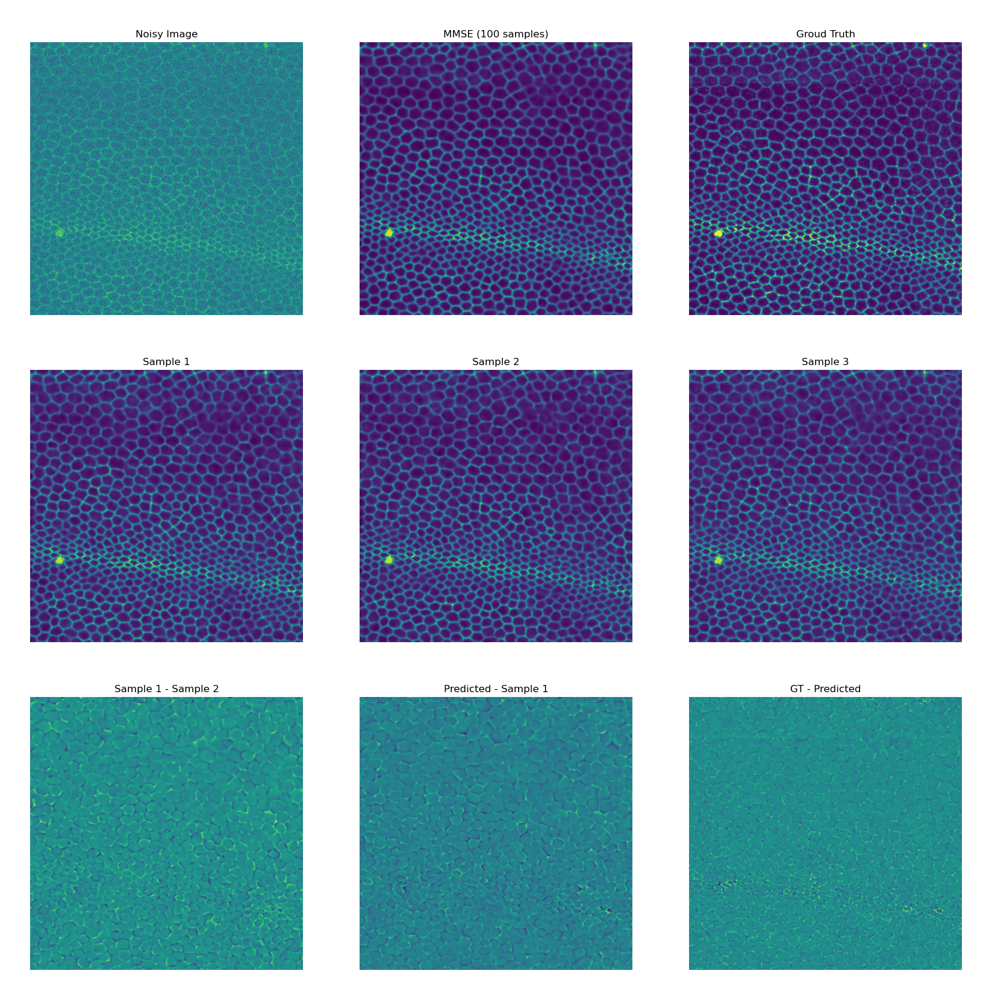

# DivNoising

## Diversity Denoising with Fully Convolutional Variational Autoencoders Reimplementation for Deep Learning Course in Koç University

This repo will contain the Julia implementation of the paper Diversity Denoising with Fully Convolutional Variational Autoencoders with the Koç University Deep Learning Framework (Knet).

## Train
To start training, you can use DenoiSegMouse and W2S modules. First include them by calling '''include("train_mouse.jl")''' or ''include("train_W2S.jl")'''.
```
usage: <DenoiSegMouse> [--seed SEED] [--batchsize BATCHSIZE]
                 [--epochs EPOCHS] [--nf NF] [--lr LR]
                 [--gauss_std GAUSS_STD] [--kl_anneal KL_ANNEAL]
                 [--minvar MINVAR] [--dataset DATASET]

Fully Unsupervised  or Unsupervised Training on DenoiSeg Mouse and
DenoiSeg Mouse s&p datasets.

optional arguments:
  --seed SEED           random number seed: use a nonnegative int for
                        repeatable results (type: Int64, default: -1)
  --batchsize BATCHSIZE
                        minibatch size (type: Int64, default: 32)
  --epochs EPOCHS       number of epochs for training (type: Int64,
                        default: 1000)
  --nf NF               number of filters for first conv layer of
                        encoder (type: Int64, default: 32)
  --lr LR               initial learning rate (type: Float64, default:
                        0.001)
  --gauss_std GAUSS_STD
                        Gaussian noise assumption for the dataset,if
                        it is negative fully unsupervised traning is
                        performed (type: Float64, default: -1.0)
  --kl_anneal KL_ANNEAL
                        How many epochs to perform kl annealing
                        starting from first epoch. [To prevent
                        posterior collapse, KL annealing aproach might
                        be needed.] (type: Int64, default: 0)
  --minvar MINVAR       minimum allowed variance required for
                        [original implementation uses 9.0 for Mouse
                        and  1.0 for Mouse s&p] (type: Float64,
                        default: -1.0)
  --dataset DATASET     Choose 0 for  Mouse and 1 for Mouse s&p (type:
                        Int64, default: 0)
```

```
usage: <W2S> [--seed SEED] [--batchsize BATCHSIZE]
                 [--epochs EPOCHS] [--nf NF] [--lr LR]
                 [--channel CHANNEL] [--avg AVG] [--minvar MINVAR]

Fully Unsupervised Training on W2S datasets.

optional arguments:
  --seed SEED           random number seed: use a nonnegative int for
                        repeatable results (type: Int64, default: -1)
  --batchsize BATCHSIZE
                        minibatch size (type: Int64, default: 32)
  --epochs EPOCHS       number of epochs for training (type: Int64,
                        default: 1000)
  --nf NF               number of filters for first conv layer of
                        encoder (type: Int64, default: 32)
  --lr LR               initial learning rate (type: Float64, default:
                        0.001)
  --channel CHANNEL     W2S dataset channel to train 0,1 or 2 (type:
                        Int64)
  --avg AVG             W2S 1 or 16 corresponds to Avg1 and Avg 16
                        respectively (type: Int64)
  --minvar MINVAR       minimum allowed variance [original
                        implementation uses 1.0 for Avg16 9.0 for
                        Avg1] (type: Float64)

```
Please check train.ipynb for details. It shows how to reproduce my results.


## Qualitative Results
### **DenoSeg Flywing**



## Citation
```bibtex
@article{2020DivNoising,
  title={DivNoising: Diversity Denoising with Fully Cnvolutional Variational Autoencoders},
  author={Prakash, Mangal and Alexander Krull and Jug, Florian},
  journal={arXiv preprint arXiv:2006.06072},
  year={2020}
}
